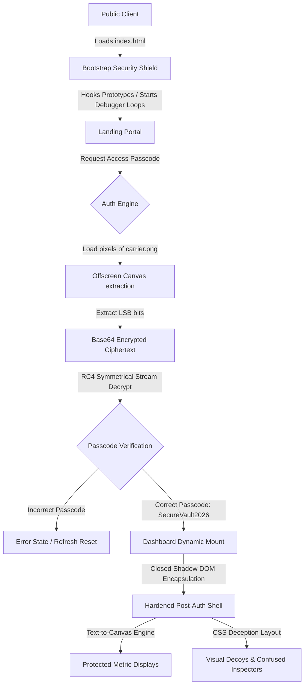

# Maximum Secure Static Site (MSSS) - Security & Architecture Manual

Welcome to the comprehensive technical documentation for the **Maximum Secure Static Site (MSSS)**. This manual provides a deep architectural breakdown, threat modeling analysis, setup instructions, and detailed descriptions of each client-side protection mechanism implemented in this project.

---

## 1. Architectural Overview

MSSS is a client-side secured portal designed to prevent data scraping, structural DOM inspection, visual content theft, and direct debugging. It follows a single-page access control structure where all sensitive metrics and features are encrypted at build time and decrypted dynamically only upon successful authentication.



### Separation of Environments
- **Source Environment (`src/`)**: A clean, modular codebase using ES6 modules. It is highly readable for security auditing and code maintenance.
- **Distribution Environment (`dist/`)**: The hardened production compilation. It contains minified HTML, compiled Tailwind CSS, a generated steganographic carrier, and heavily obfuscated, self-defending, and anti-tampering JavaScript bundles.

---

## 2. Threat Modeling & Scope

### In-Scope Defenses
1. **Passive Automated Scrapers**: Browser extensions or CLI scripts trying to read the DOM tree.
2. **Standard Inspector Inspections**: Users attempting to right-click, highlight text, use F12 shortcuts, or point at elements.
3. **Amateur Reverse Engineering**: Casual users attempting to inspect global JavaScript variables, modify prototypes, or review the terminal console.
4. **Offline Code Inspection**: Scrapers extracting the raw Javascript source to review static strings and tokens.

### Out-of-Scope (Client-Side Cryptography Limitations)
As a static site, all computational operations take place on the client's device. An extremely sophisticated attacker with deep debugger hooks (e.g. customized browser builds, operating system-level process debuggers, or custom proxy scripts) can eventually capture the decrypted in-memory variables. MSSS is designed to **maximize the work factor** required, making automated scraping and standard reverse-engineering economically unviable.

---

## 3. Exhaustive Security Checklist Implementation

The following 12 mandatory security defenses work cohesively:

### 1. Block Inspect Element
- **Methodology**: Captures standard Developer Tools launch hotkeys and interrupts them before the browser executes the default behavior.
- **Implementation**: `src/js/modules/shield.js` intercepts global `keydown` events. Keycodes for `F12` (123) and combinations like `Ctrl+Shift+I` / `Cmd+Option+I` are captured, calling `e.preventDefault()` and `e.stopPropagation()`.

### 2. Code Obfuscation
- **Methodology**: Rewrites source JavaScript files into highly convoluted, non-human-readable structures.
- **Implementation**: The Node.js compiler (`build.js`) runs `javascript-obfuscator` during the packaging step. It injects:
  - **Control Flow Flattening**: Breaks logical loops and code paths into randomized switch/case structures, obscuring code progression.
  - **Dead Code Injection**: Merges real instructions with functional decoy blocks to trigger false paths in decompilers.
  - **String Splitting & Arrays**: Collects all text variables into encoded string buffers (`base64`, `rc4`) that are rebuilt at runtime.

### 3. Code Minification
- **Methodology**: Strips comments, human-readable formatting, and redundant spaces to compress output and reduce code hints.
- **Implementation**: Handled automatically in `build.js` using `html-minifier-terser` (for HTML) and Tailwind's built-in mini-purger (for CSS). `javascript-obfuscator` automatically outputs minified JS.

### 4. Block View Source
- **Methodology**: Blocks user interfaces that call the raw document text.
- **Implementation**:
  - Global click interceptors disable `contextmenu` clicks (right-clicks) entirely across the page.
  - Keyboard interceptors capture `Ctrl+U` and `Cmd+Option+U` to prevent opening the `view-source:` protocol.

### 5. Block Console
- **Methodology**: Overrides the native developer interface to suppress runtime logs and clear active debug panels.
- **Implementation**: `src/js/security.js` binds empty dummy functions to all `console` channels (e.g. `console.log`, `console.error`) with `writable: false` and `configurable: false` descriptors. Additionally, a background interval triggers `console.clear()` every 300ms to wipe console buffers.

### 6. DOM & Code Protection
- **Methodology**: Closes down standard element query methods and seals prototype bindings.
- **Implementation**:
  - Sensitive elements are locked within a closed Shadow DOM (see feature 12).
  - Global prototypes (`Object.prototype`, `Array.prototype`, `Function.prototype`) are frozen via `Object.freeze()` to block prototype pollution or DOM element modifications.

### 7. Base64 Encoding & Insurance
- **Methodology**: Encodes tokens and structural objects in multiple base64 layers combined with a symmetric cipher to prevent static string recovery.
- **Implementation**: Configured in `src/js/modules/auth.js` (`base64Encode` and `base64Decode` with UTF-8 byte mappings) to handle the encrypted RC4 payloads.

### 8. CSS Deception / Layout Protection
- **Methodology**: Masks structural hierarchy through randomized visually ordered elements and decoy content blocks.
- **Implementation**:
  - `src/index.html` contains hidden decoy divs with dummy access tokens (`admin-panel-secret-wrapper`, `payment-endpoint-security-bypass`) to confuse automated HTML parsing scripts.
  - Dashboard panels use Tailwind flex ordering (`order-2 lg:order-2`, `order-1 lg:order-1`) so the order in the DOM tree does not match the visual display order on the screen.

### 9. Security via Steganography
- **Methodology**: Bakes critical access structures into the raw pixels of an image asset, bypassing file-system string searches.
- **Implementation**:
  - **Build-Time**: `build.js` generates a `carrier.png` file using pure-JS pixel structures. It encrypts the auth package and encodes the bits inside the Least Significant Bits (LSB) of the image's RGBA channels (excluding Alpha).
  - **Runtime**: `src/js/modules/auth.js` loads `carrier.png` via a Promise wrapper, draws it inside an offscreen `<canvas>` buffer, extracts raw pixel bytes using `getImageData`, and reconstructs the bit stream to recover the base64 ciphertext.

### 10. Text-to-Image / Text-to-Canvas Rendering
- **Methodology**: Renders critical characters directly as vector pixels to prevent manual copying or reader parsing.
- **Implementation**: `src/js/modules/render.js` features a `createSecureTextCanvas` helper. Sensitive metric strings (Authorization level, session keys, custom message) are written directly onto high-density, DPI-scaled `<canvas>` coordinates using Canvas2D text render APIs, ensuring text selection is physically impossible.

### 11. Secure Session Storage
- **Methodology**: Encapsulates active session tokens inside encrypted payloads before write.
- **Implementation**: `saveSession()` and `loadSession()` in `src/js/modules/auth.js` encrypt the session using a custom RC4 stream with a unique storage key and nested base64 wrapping, protecting the session data from inspector exploration.

### 12. Document Properties & Integrity Control
- **Methodology**: Freezes critical interfaces, forces code loops if alterations are detected, and isolates visual pages.
- **Implementation**:
  - **Shadow DOM Encapsulation**: Mounts the authenticated dashboard inside a closed Shadow DOM (`shadowRoot = host.attachShadow({ mode: 'closed' })`). External selectors like `document.querySelector` or console lookups return `null` when searching inside this container.
  - **Self-Defending JS**: Integrated into the obfuscated bundle. If the JavaScript file is altered or prettified, its internal checksum changes, causing the application to self-break and cease working.
  - **Infinite Debugger Loop**: `src/js/security.js` invokes a recursive dynamic `debugger` thread using `Function.prototype.constructor`. If DevTools is forced open, this loop triggers, instantly halting execution and freezing the browser interface.

---

## 4. Operational Setup Guide

### Local Development
To launch the project locally for debugging or extending components:

1. **Install Dependencies**:
   ```bash
   npm install --no-bin-links
   ```
2. **Execute Build**:
   ```bash
   npm run build
   ```
3. **Launch Dev Live Server**:
   ```bash
   npm run dev
   ```
   *The local server will spin up on `http://localhost:3000` pointing directly to the development `src/` directory. (Note: active debugger loops are bypassed on localhost to allow development debugging).*

4. **Verify Secure Production Site**:
   ```bash
   npm run prod
   ```
   *Runs a local server pointing to the protected, obfuscated `dist/` folder.*

---

## 5. Build Pipeline & GitHub Actions Workflow

The automated compilation and deployment flow is configured in `.github/workflows/deploy.yml`:

```
[Local Git Push] ---> [GitHub Repository (main)]
                              │
                              ▼
                      [GitHub Actions Runner]
                              │
                              ├── Setup Node.js v20
                              ├── Restore npm cache
                              ├── Run 'npm ci' (Install build tools)
                              ├── Run 'npm run build' (Compile CSS, Obfuscate JS, Stego Asset)
                              └── Deploy compiled 'dist/' directory to 'gh-pages' branch
```

Deploying only the `dist/` directory guarantees that **no readable source code files** are ever published to the public static hosting server, ensuring complete front-end protection.
